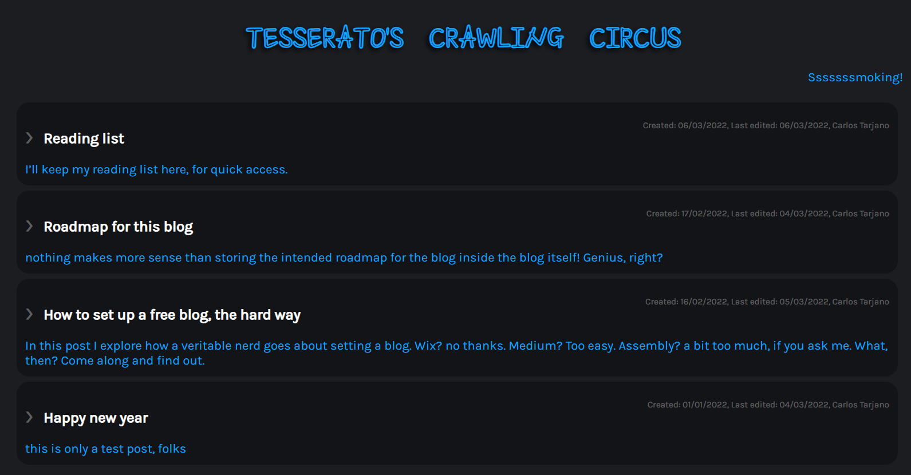

I guess it makes sense that my first blog post would be about how to set up a blog. But first, let's take a look at my background and motivation to know why I decided to start a blog, and what would be the best approach to do so, considering technologies I'm already familiar with.

You see, recently I started to use Obsidian to store thoughts and incomplete ideas, and to record pieces of information that might be useful in the future. The problem is that, as it is meant to be consumed by myself only, it is hard to find the motivation to really polish those notes. I see no point in dating them, too, so, you eventually are in a situation when you don't know if that preliminary research in how to embed 3D animations in HTML is reasonably up to date, or if it is worth redoing it in face of new tech that might have emerged.

The motivation to set up a blog is twofold, then: maybe gather a small community about general nerdy topics and put in place a live knowledge system, that can be referred back by me and this community, with opinions about relevant technologies.

To sum it up:

- Git, git everywhere!
- **Markdown too, please, but that is kind of standard nowadays** I remember when I started to dabble with HTML, back in the day, and my first thought was "who the hell came up with this bloated syntax?"
- Free, and preferably open-source
- closest to a static website as possible
- A comment system, to get some insight and feedback
- integrations with LinkedIn, Twitter, Facebook, Instagram and possible others, like medium
- Set and forget - given my tendency to tinkering, the more separation of concerns, the better
- Mailing list
- **RSS** I almost forgot about this one

# Possible setups
Reading about content management systems (CMS) on the internet, some alternatives catched my eye:

- Ghost
- Grav
- Jekyll
- [Eleventy](https://www.11ty.dev/)
- [Pelican](https://docs.getpelican.com/en/latest/index.html#)
- [The world’s fastest framework for building websites | Hugo](https://gohugo.io/)
- [Nikola](https://getnikola.com/)
- 

# Comment systems

- disqus
- [Staticman](https://staticman.net/)
- [Talkyard](https://www.talkyard.io/)
- [Flarum](https://flarum.org/)
- [utterances](https://utteranc.es/)

# Conclusion

Pandoc + Python's beautiful soup

# Useful links

- [A Deep Dive Into Eleventy Static Site Generator](https://www.smashingmagazine.com/2021/03/eleventy-static-site-generator/)
- [Setup a Free Self-hosted Blog in Under 15 Minutes!](http://www.theappliedarchitect.com/setup-a-free-self-hosted-blog-in-under-15-minutes/)
- [Building A Static Blog With Eleventy And Staticman](https://kabardinovd.com/posts/eleventy-staticman/)
- [How to Create and Deploy Your First Eleventy Website](https://www.digitalocean.com/community/tutorials/-how-to-create-and-deploy-your-first-eleventy-website)
- [I Finally Understand Eleventy's Data Cascade.](https://benmyers.dev/blog/eleventy-data-cascade/)
- [TESTING UTTERANCES COMMENTS](https://blog.bartekr.net/2021/01/17/testing-utterances-comments/)
- [Replacing Disqus with Github Comments](https://donw.io/post/github-comments/)
- [A List of Static Site Generators for Jamstack Sites](https://jamstack.org/generators/)
- [Convert Markdown to HTML with Pandoc](https://www.arthurkoziel.com/convert-md-to-html-pandoc/)

-------------
It's 2024 now and much has changed: I changed countries, sold my house, worked like there is no tomorrow to develop a NLP agent in a startup, and here I am, retaking this project. I ended up developing a static site generator in Rust, that I intend to publish when it gets a little bit more polished.

