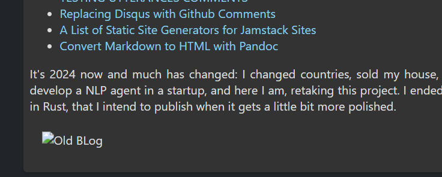

# Roadmap:

- [ ] Comments
- [x] Better markdown support
- [ ] RSS feeds
- [ ] CSS
- [ ] Biblatex support ?
- [x] Created date for articles (in addition to last edited date)
- [ ] Analytics
- [ ] Command to generate template md file
- [ ] Fix tags only as arrays bug
- [ ] Support for specifying tags directly on file path
- [ ] Change name of build root folder (right now it mimics the name of the origin folder so, for example, we have a src folder in the destination folder)

# Known issues:
- [ ] Links to images, etc. break at first page when "dropdown" is enabled 

  